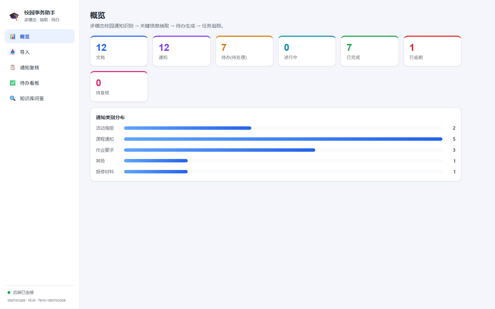
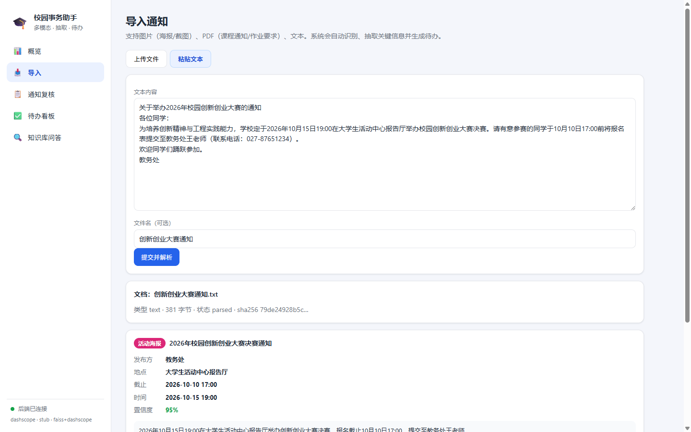
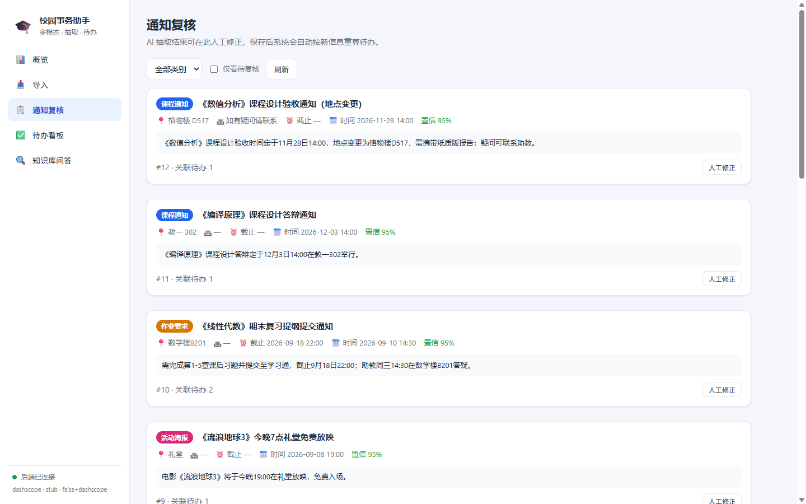
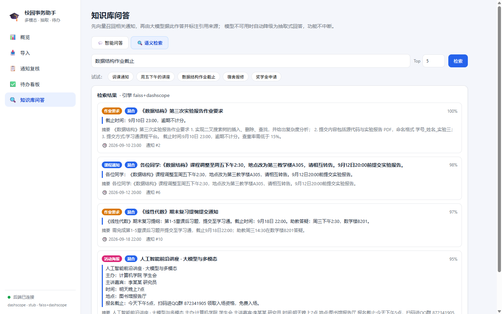
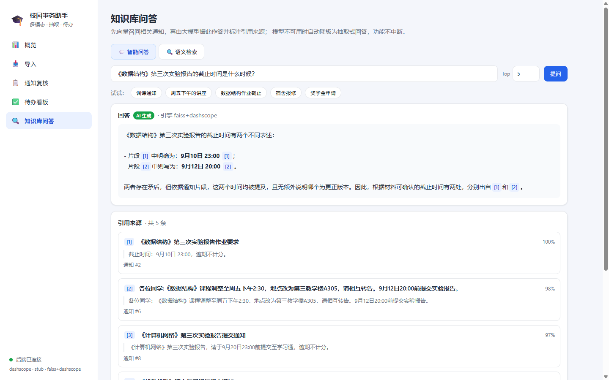
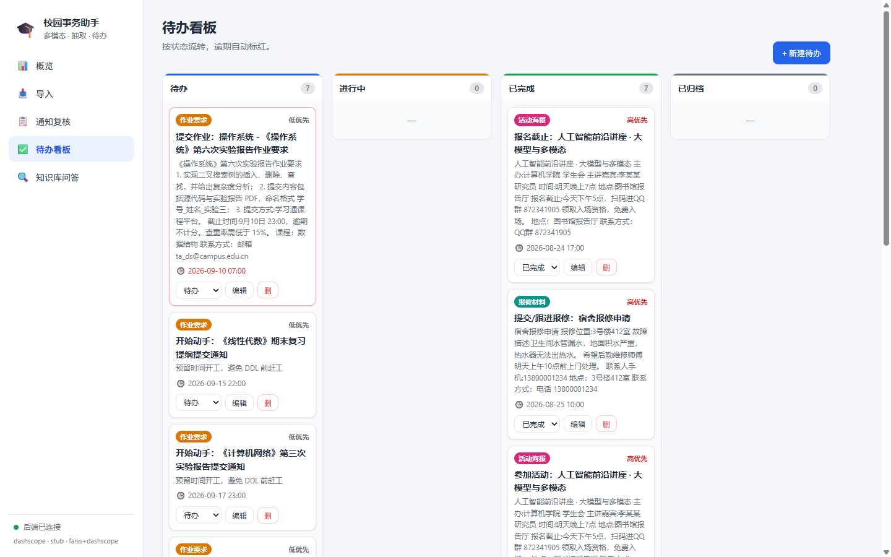
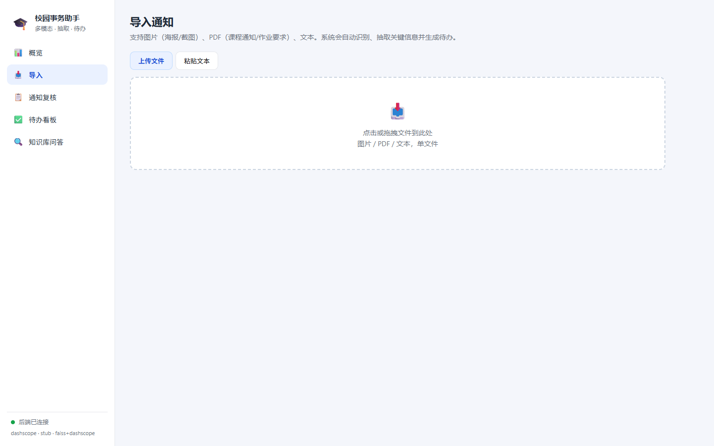
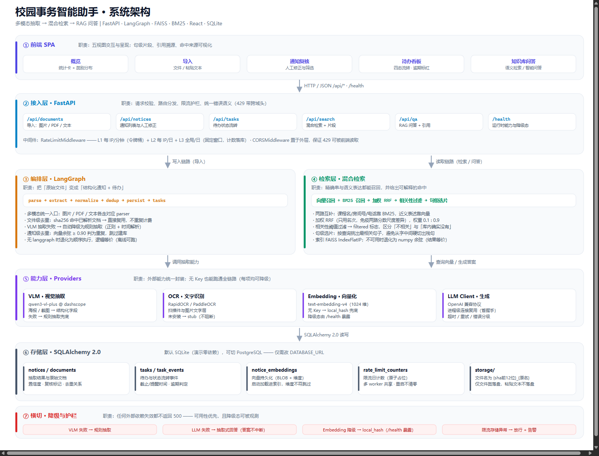

# 校园事务智能助手 🎓

[](https://github.com/Kevin-fang-23/campus-assistant/actions/workflows/ci.yml)

面向本科生的**多模态校园信息处理**工具：把课程通知、活动海报、作业要求、报修材料（图片 / PDF / 文本）丢进来，系统自动完成 **通知识别 → 关键信息抽取 → 待办生成 → 任务追踪**，并用 **BM25 + 向量混合检索** 支撑自然语言问答与溯源，帮你不再错过截止时间。

> **开箱即用：无需任何 API Key。** 默认用内置规则（Mock VLM + 本地哈希向量 + Stub OCR）即可跑通完整链路；接入阿里云百炼 `qwen3-vl-plus` 后抽取与向量质量进一步提升。



---

## 🖼️ 界面预览

以下均为**真实运行**截图（非设计稿）：后端 `uvicorn` + 前端 `vite`，数据库含 12 条通知 / 14 条待办，
VLM 接百炼 `qwen3-vl-plus`、向量接 `text-embedding-v4`。

| 导入 → 抽取（关键流程） | 通知复核 |
|---|---|
|  |  |
| 粘贴通知原文 → 自动抽取**发布方 / 地点 / 截止 / 时间 / 置信度**并生成待办 | AI 抽取结果可人工修正，保存后自动按新信息重算待办 |

| 混合检索（句级片段） | RAG 问答（引用溯源） |
|---|---|
|  |  |
| 每条命中标注**来源**（语义/关键词/混合）与**句级片段**，片段即"为什么召回这条" | 答案内 `[1] [2]` 标注来源，下方引用片段可逐条溯源 |

| 待办看板 | 导入（上传文件） |
|---|---|
|  |  |
| 四态流转（待办/进行中/已完成/已归档），逾期自动标红 | 支持图片（海报/截图）、PDF、纯文本 |

---

## 🏗️ 系统架构



> 完整分层说明、数据流向、**降级矩阵**与设计取舍见 **[`docs/architecture.md`](./docs/architecture.md)**。

一句话概括分层：**前端 5 视图 → FastAPI 接入（限流护栏）→ LangGraph 编排（写入）/ 混合检索（读取）
→ Providers 能力层（每项可降级）→ SQLAlchemy 存储**。
关键取舍：把外部能力收敛到 `providers/` 一层，因此**无 API Key 时全链路仍可跑通**（自动降级）。

---

## 🎯 核心亮点

| 能力 | 量化结果 | 复现方式 |
|---|---|---|
| **BM25 + 向量混合检索** | RRF 融合双路召回，权重由 129 条查询扫描标定；混合 MRR@5 **0.972**（本语料上纯 BM25 更高 0.980，原因与局限见基线文档） | `python -m eval.run_retrieval_eval --embedding dashscope --sweep` |
| **句级片段选择** | 引用片段直接支撑答案；修复"答案句落在 400 字后被硬截断、LLM 只能答未找到" | `pytest tests/test_snippet.py` |
| **LLM 连接复用** | 20 次问答的 TCP 建连数 **21 → 1**（降约 95%） | `pytest tests/test_llm_client_reuse.py`（起真实本地服务器统计 TCP 连接数） |
| **三层请求限流** | 分钟级 / 每 IP 日 / 全局日，防止公网演示烧干额度 | `.env` 的 `RATE_LIMIT_*` |
| **限流计数持久化** | 日计数写 SQLite（WAL，**88.8µs/请求**）：4 个真实子进程共享额度 40 实测**每次恰好放行 40 次**、重启不清零 | `pytest tests/test_rate_limit_persistence.py` |
| **检索与评测** | 后端 **334 passed**；检索质量门禁接入 CI（MRR@5 基线 **0.9587**，劣化即 fail）；抽取评测 40 案例微平均 F1 **0.98** | `pytest -q`、`python -m eval.run_retrieval_eval --gate` |
| **CI** | 每次推送自动跑后端测试 + 检索质量门禁 + 前端类型检查与构建（无需任何密钥） | 见上方 CI 徽章、`.github/workflows/ci.yml` |

---

## ✨ 功能特性

### 信息处理链路
- **多模态导入**：图片（海报/截图）、PDF（课程通知/作业要求）、纯文本，拖拽或粘贴即可。
- **通知识别 + 关键信息抽取**：自动判定类别（课程通知 / 活动海报 / 作业要求 / 报修材料），抽取标题、发布方、地点、课程、截止时间、活动时间、联系人、标签。
- **中文时间语义**：相对日期（"3天后"）、星期（"周五"）、改期 vs 原定（"调整至周五…原定周三…"）精准区分；截止默认补到 23:59。
- **待办生成**：按规则自动拆出"开始动手 / 提交"等任务，带优先级与提醒时间。
- **任务追踪**：看板（待办 / 进行中 / 已完成 / 已归档）状态流转，逾期自动标红，状态变更写入审计时间线。
- **去重**：内容向量相似度 ≥ 0.90 判定为重复通知，自动跳过入库。
- **人工复核**：低置信度结果进"待复核"，可在前端修正，保存后自动重算待办。

### 检索与问答
- **混合检索**：向量（语义）与 BM25（字面精确）双路召回后 RRF 融合。校园场景充斥课程名、房间号、电话、缩写等精确串，向量路对它们不可靠，BM25 一次命中。
- **句级片段选择**：引用与 LLM 上下文按**句子**择优选取，而非按字符硬截断 —— 引用不会是残句，长通知的关键信息也不会被截掉。
- **RAG 问答**：`/api/qa` 基于检索结果生成答案，答案内用 `[1] [2]` 标注来源，并附可溯源的引用片段。
- **降级可控**：无 Key / 上游失败时自动切换为抽取式回答（`degraded=true`），前端展示逻辑不变。

### 工程特性
- **连接复用**：LLM / Embedding 共用进程级 HTTP 客户端，复用连接池，避免每请求一次 TLS 握手。
- **请求限流**：三层策略保护成本端点（`/api/qa` 与 `/api/documents/*`）与只读接口；
  日计数持久化到 SQLite，多 worker 共享额度、跨重启保留（见下方「请求限流」）。
- **优雅降级**：向量后端缺失 → NumPy 余弦回退；OCR 缺失 → Stub；LangGraph 缺失 → 顺序执行。
- **单端口部署**：构建前端后由后端直接托管 `dist`，公网只需映射一个端口，且页面与 API 同源。

> 技术细节：**LangGraph** 编排识别→抽取→校验→去重→待办 的流水线；**SQLAlchemy 2.0** 双兼容 SQLite / PostgreSQL；**PaddleOCR / RapidOCR** 可插拔。

---

## 🧱 技术栈

| 层 | 选型 |
|---|---|
| 前端 | React 18 + TypeScript + Vite 5 |
| 后端 | Python + FastAPI + SQLAlchemy 2.0 + Pydantic v2 |
| 流程编排 | LangGraph（可选，自动降级） |
| 视觉大模型 | Mock / 阿里云百炼 OpenAI 兼容接口（qwen3-vl-plus 等） |
| 文本问答模型 | 百炼 `qwen-plus`（无需视觉能力，比 VL 便宜） |
| OCR | PaddleOCR / RapidOCR / VLM / Stub（自动探测） |
| 向量检索 | FAISS（缺失时 NumPy 余弦回退）+ 自实现 BM25（零新依赖） |
| 融合排序 | RRF（Reciprocal Rank Fusion），对两路分数尺度不敏感 |
| 数据库 | SQLite（开发）/ PostgreSQL（生产，可选 pgvector） |

---

## 📁 目录结构

```
campus-assistant/
├── backend/                      # FastAPI 后端
│   ├── app/
│   │   ├── api/                  # REST 路由
│   │   │   ├── documents.py      #   导入（上传 / 粘贴文本）
│   │   │   ├── notices.py        #   通知列表 / 详情 / 人工复核
│   │   │   ├── tasks.py          #   任务看板 / 流转 / 统计
│   │   │   ├── search.py         #   混合检索
│   │   │   └── qa.py             #   RAG 问答
│   │   ├── graph/                # LangGraph 流水线（classify→extract→validate→dedup→todo）
│   │   ├── parsers/              # 多模态解析（text / image / pdf → 统一 ParsedDoc）
│   │   ├── providers/            # 抽象与多实现
│   │   │   ├── vlm.py            #   视觉模型（mock / dashscope）
│   │   │   ├── ocr.py            #   OCR（paddle / rapid / vlm / stub）
│   │   │   ├── embedding.py      #   向量（dashscope / local_hash）
│   │   │   └── llm_client.py     #   OpenAI 兼容客户端（共享连接池 + 重试退避）
│   │   ├── services/
│   │   │   ├── bm25.py           #   BM25 索引（字符 bigram 分词）
│   │   │   ├── hybrid.py         #   双路召回 + RRF 融合 + 索引写入入口
│   │   │   ├── snippet.py        #   句级片段选择（纯函数）
│   │   │   ├── notice_text.py    #   通知文本来源与片段（问答/检索共用）
│   │   │   ├── rate_limit.py     #   三层限流策略与判定
│   │   │   ├── rate_limit_store.py #  日计数持久化（SQLite/内存/文件后端）
│   │   │   ├── vector_store.py   #   FAISS / NumPy 向量库
│   │   │   ├── rule_extract.py   #   规则抽取兜底
│   │   │   ├── datetime_utils.py #   中文时间归一化
│   │   │   └── ingest.py         #   入库编排
│   │   ├── middleware.py         # 限流中间件
│   │   ├── config.py             # 全部可通过环境变量覆盖
│   │   ├── models.py             # ORM 模型与常量
│   │   ├── schemas.py            # Pydantic 契约
│   │   ├── db.py                 # 引擎 / Session
│   │   ├── main.py               # 应用入口 + CORS + 限流 + /health + 静态托管
│   │   └── seed.py               # 5 条演示数据（4 类 + 1 条近似重复）
│   ├── tests/                    # 14 个测试模块 / 334 条用例
│   ├── eval/                     # 离线评测（抽取质量 + 检索质量 + 阈值标定 + 门禁基线）
│   ├── requirements.txt          # 全部依赖（含可选 OCR/DB 引擎）
│   ├── requirements-ci.txt       # CI 依赖（核心 + 生产路径，不含 OCR 栈）
│   ├── Dockerfile
│   └── .env.example
├── frontend/                     # React + Vite + TS
│   ├── vitest.config.ts          # 测试配置（happy-dom + setup）
│   └── src/
│       ├── api.ts                # 类型化 API 客户端
│       ├── types.ts              # 与后端 schema 对齐的 TS 类型
│       ├── common.tsx            # 标签 / 颜色 / 格式化
│       ├── App.tsx               # 侧边栏 + 视图切换
│       ├── test/setup.ts         # 测试前置（jest-dom 断言 + cleanup）
│       ├── *.test.ts             # 纯逻辑测试（common / api）
│       └── components/           # Dashboard / Upload / Notices / Tasks / Search（含 Search.test.tsx）
├── .github/workflows/ci.yml       # CI：后端测试 + 检索质量门禁 + 前端类型检查与构建
├── docs/                          # 架构说明与界面截图
│   ├── architecture.md           #   分层职责 / 数据流向 / 降级矩阵 / 设计取舍
│   ├── architecture.svg          #   架构图矢量源（可编辑）
│   └── images/                   #   README 用图（架构图 + 6 张真实界面截图）
├── .env.example                   # 环境变量模板（配置从项目根 .env 读取）
├── docker-compose.yml            # 可选：PostgreSQL(pgvector) + 后端
├── start.sh / start.bat          # 一键启动脚本
└── stop.bat                      # 按端口杀进程，停止服务
```

---

## 🚀 快速开始

### 1) 后端

需要 Python 3.11+（本项目在 3.13 上开发与验证）。建议用虚拟环境：

```bash
cd campus-assistant/backend

# 创建并激活虚拟环境（任选其一）
python -m venv .venv && source .venv/bin/activate        # macOS/Linux
# .venv\Scripts\activate                                     # Windows

# 安装依赖
pip install -r requirements.txt

# （可选）复制配置模板并修改
# 注意：配置从「项目根目录」的 .env 读取（同时也兼容 backend/.env）
cp ../.env.example ../.env

# 启动（默认 http://127.0.0.1:8000）
python -m uvicorn app.main:app --host 0.0.0.0 --port 8000 --reload
```

启动后访问：
- API 文档：`http://localhost:8000/docs`
- 健康检查：`http://localhost:8000/health`（返回流水线引擎、VLM/OCR/向量后端与是否降级）

> 若 8000 被占用，换端口（如 `--port 8001`），并同步修改 `frontend/vite.config.ts` 里的代理 `target`。

#### 灌入演示数据（可选）

```bash
python -m app.seed
```

会写入 5 条样例通知（4 类 + 1 条近似重复），可在前端「概览 / 通知复核」直接看到效果。

### 2) 前端

需要 Node 18+。

```bash
cd campus-assistant/frontend
npm install
npm run dev          # 开发服务器 http://localhost:5173
```

前端开发服务器已将 `/api` 与 `/health` 反向代理到 `http://localhost:8000`，直接打开 `http://localhost:5173` 即可使用。

生产构建：

```bash
npm run build        # 产物在 dist/
npm run preview      # 本地预览构建产物
```

> 构建出 `frontend/dist` 后，后端启动时会**自动挂载**它到 `/`，此时单端口（8000）即可访问完整应用，无需再开前端服务。

---

## 🔍 检索与问答实现

这一部分是项目的技术核心，三条链路串联如下：

```
用户提问
   │
   ├─ 向量检索 ── Embedding ── FAISS  ──┐
   │                                    ├─ RRF 融合 ── 排序结果
   └─ BM25 检索 ─ 字符 bigram 索引 ─────┘        │
                                                 ▼
                                    句级片段选择（select_snippet / select_context）
                                                 │
                                    ┌────────────┴────────────┐
                                    ▼                         ▼
                              引用溯源片段              拼成 context 交给 LLM
```

### 混合检索

- **BM25 实现**（`services/bm25.py`）：中文无空格，为避免引入分词器依赖，采用**字符 bigram** 作 term（`"线性代数"` → `线性/性代/代数`；`"027-87659999"` 保留数字串的区分度）。标准 BM25 公式，`k1=1.5`、`b=0.75`。
- **融合策略**（`services/hybrid.py`）：用 **RRF** 而非加权求和 —— BM25 分数与余弦相似度量纲不同，RRF 只看名次，无需做归一化标定。融合结果再映射到 `[0,1]` 供前端展示百分比。
- **索引一致性**：向量与 BM25 由同一入口 `index_notice()` 写入，避免"向量更新了而 BM25 没更新"的静默不一致。
- **BM25 索引正文**：BM25 的价值就是精确串匹配，因此索引完整正文（含电话、房间号、邮箱），而非仅结构化字段。

**权重与依据**：

```bash
# 扫描 0.0~1.0 的权重组合，输出 MRR@5 / Recall / nDCG
python -m eval.run_retrieval_eval --embedding dashscope --sweep
```

默认 `HYBRID_WEIGHT_VECTOR=0.1` / `HYBRID_WEIGHT_BM25=0.9`，由 **55 条语料 / 129 条查询**实测确定（详见 `backend/eval/RETRIEVAL_BASELINE.md`）：

| 配置 | Recall@1 | MRR@5 | nDCG@5 |
|---|---|---|---|
| 仅向量 | 0.915 | 0.933 | 0.937 |
| 仅 BM25 | **0.969** | **0.980** | **0.982** |
| 混合 0.1:0.9 | 0.961 | 0.972 | 0.976 |

**这个结果需要如实说明**：在本语料上纯 BM25 表现最好，且权重曲线从 0.00 到 0.25 **单调下降**——向量路没有成为任何一条查询的唯一赢家（互补性分析：仅 BM25 独有赢下 5 条，仅向量 0 条）。

原因是语料只有 55 条、中文校园查询词面密集（课程名/房间号/电话/缩写都是字面命中），此规模下 BM25 的字面区分度足够高。仍保留 0.1 而非取实测最优的 0.0，是为了在语料扩大、或遇到与原文零字面重叠的改写查询时留有语义兜底，代价 0.8 个百分点。

> 若确定只服务小语料、追求实测最高分：把 `HYBRID_WEIGHT_VECTOR` 设为 `0`，即退化为纯 BM25。

⚠️ 语料规模变化后**务必重跑 `--sweep` 重新定标**，不要沿用当前值。

### 句级片段选择

原先两处都用字符硬截断：`text[:120]`（引用片段）与 `text[:400]`（LLM 上下文）。这带来两个问题：

1. 引用可能从句子中间切断 → 残句；
2. **更严重**：海报体通知的关键信息（截止时间/地点/联系方式）常落在 400 字之后，被截掉后 LLM 看不到，只会回答"未找到"，而库里其实有答案。

现在改为按句择优（`services/snippet.py`，纯函数、无 I/O）：

- **打分**：`(2.0×bigram覆盖率 + 0.6×unigram覆盖率)×10 + 意图奖励`；
- 用**覆盖率而非绝对计数**，否则长句靠堆词获胜；
- 意图奖励区分**具体值**（`23:00`、`图书馆`、电话）与**泛指词**（"延长开放时间"）两档；
- 输出取原文**字符区间**，保留海报体的换行排版。

### 连接复用

LLM 与 Embedding 共用进程级客户端（`providers/llm_client.py`），provider 按需解析客户端引用而非长期持有。实测 20 次 `/api/qa` 的 TCP 建连数 **21 → 1**（含 query embedding 在内的 40 次 HTTP 请求复用同一条连接）。

---

## ⚙️ 配置（`.env`）

全部可经环境变量覆盖，关键项：

### 基础

| 变量 | 默认 | 说明 |
|---|---|---|
| `DATABASE_URL` | SQLite | 生产改 `postgresql+psycopg://...` |
| `STORAGE_DIR` | `backend/storage` | 上传文件落盘目录 |
| `CORS_ORIGINS` | `localhost:5173` 等 | 允许的前端来源 |

### 模型与向量

| 变量 | 默认 | 说明 |
|---|---|---|
| `VLM_PROVIDER` | `mock` | `dashscope` 走阿里云百炼 |
| `DASHSCOPE_API_KEY` | 空 | 填了才启用真实 VLM / 向量 / 问答 |
| `VLM_MODEL` | `qwen3-vl-plus` | 可改 `qwen3.5-vl-plus` 等 |
| `QA_PROVIDER` | `auto` | `mock` 强制走抽取式降级路径 |
| `QA_MODEL` | `qwen-plus` | 纯文本问答模型 |
| `OCR_PROVIDER` | `auto` | 自动探测 Paddle / Rapid / VLM / Stub |
| `EMBEDDING_PROVIDER` | `auto` | 有 Key 用 dashscope，否则本地哈希 |
| `DEDUP_THRESHOLD` | `0.90` | 向量相似度阈值 |
| `REVIEW_CONFIDENCE_THRESHOLD` | `0.55` | 低于此置信度进"待复核" |

### 混合检索

| 变量 | 默认 | 说明 |
|---|---|---|
| `HYBRID_ENABLED` | `true` | 关掉即回退纯向量检索 |
| `HYBRID_WEIGHT_VECTOR` | `0.1` | 向量路权重（见上文定标依据与实测结论） |
| `HYBRID_WEIGHT_BM25` | `0.9` | BM25 路权重 |
| `HYBRID_RRF_K` | `60` | RRF 平滑常数，取自原论文 |
| `HYBRID_FETCH_K` | `20` | 每路候选池大小（须 > `top_k`，否则失去融合意义） |
| `BM25_K1` / `BM25_B` | `1.5` / `0.75` | BM25 词频饱和与长度归一化参数 |

### 相关性阈值（是否提示「未找到相关内容」）

检索平时恒返回 top-k，因此问"今天天气怎么样"也会给出 3 条通知，像是胡答。
阈值判定要求候选文档与查询**共享的「二字及以上词」个数** ≥ `SEARCH_MIN_BIGRAM_OVERLAP`；
全部被丢弃时接口返回空列表并置 `filtered=true`，前端据此展示「未找到相关内容」。

| 变量 | 默认 | 说明 |
|---|---|---|
| `SEARCH_MIN_BIGRAM_OVERLAP` | `1` | 共享二字词个数下限；`0` = 关闭判定，退回旧行为 |
| `SEARCH_KEEP_IF_FILTERED` | `false` | `true` = 只标记不丢弃（灰度观察，便于看阈值会拦掉什么） |

**为什么不用分数做阈值**：三种候选判据（BM25 绝对分 / 余弦 / 句级选片分）实测**区间全部重叠**，
无法分离「无关」与「相关」—— 根因是中文里单字重合必然发生（"今天天气"撞"明天"里的"天"）。
判据与阈值取值的完整实测数据见 `eval/RETRIEVAL_BASELINE.md` 第五节。

### 请求限流

成本端点每次请求都会消耗额度，公网演示时需护栏。三层任一超限即返回 429：L1 每 IP 每分钟（令牌桶，拦瞬时洪峰）、L2 每 IP 每日（拦单源慢刷）、L3 全局每日（总支出上限）。数值为 `0` 表示该层不启用。

| 变量 | 默认 | 说明 |
|---|---|---|
| `RATE_LIMIT_ENABLED` | `true` | 总开关 |
| `RATE_LIMIT_TRUST_PROXY` | `false` | **置 ngrok / Nginx 之后必须设为 `true`**，否则所有访客被视为同一来源；直连公网时必须保持 `false`，否则可伪造 `X-Forwarded-For` 绕过 |
| `RATE_LIMIT_QA_PER_MIN` / `_PER_IP_DAY` / `_PER_DAY` | `6` / `60` / `300` | `/api/qa`（= 1 次 LLM + 1 次 embedding） |
| `RATE_LIMIT_INGEST_PER_MIN` / `_PER_IP_DAY` / `_PER_DAY` | `10` / `40` / `200` | `/api/documents/*`（= VLM + OCR 解析） |
| `RATE_LIMIT_DEFAULT_PER_MIN` | `120` | 其余只读接口 |
| `RATE_LIMIT_STORE` | `sqlite` | 日计数（L2/L3）存放位置：`sqlite` = 写当前库，**跨重启保留、多 worker 共享**；`none` = 只留进程内内存（多 worker 各算一份、重启清零，仅本地开发用） |

**关于多 worker（曾经的真实缺陷）**：早期实现把日计数放在进程内存里，`uvicorn --workers 4` 时每个 worker 各存一份，
实际额度 = 配置值 × 4 —— 资金护栏被稀释 4 倍；且进程重启即清零，攻击者可反复触发重启绕过每日上限。
现在日计数改为写 SQLite（`rate_limit_counters` 表），判定即读库、记账即写库，因此：

- **额度总量精确**：4 个 worker 共享额度 40 时，实测放行恰好 40 次（数据见下方"限流实现细节"）；
- **重启不清零**：进程退出后重新启动，已用额度仍在；
- **性能**：SQLite 开启 WAL 后单请求约 **88.8µs**（未开 WAL 是 4071µs，差 46 倍，代码自动开启）。
  相对一次 LLM 调用（500–3000ms）占比约 0.02‰。

**仍未解决的边界（不夸大）**：L1 每 IP 每分钟的令牌桶仍是**进程内存**，多 worker 下突发额度 = 单 worker × worker 数。
这是有意的（突发控制按实例算本就合理，共享需每请求一次网络往返）；
且本方案**仅适用单机**——多台机器时 SQLite 文件无法共享，那时必须换 Redis，
实现 `CountStore` 协议即可、`RateLimiter` 无需改动。

#### 限流实现细节（含被推翻的设计）

选 SQLite 而非 Redis，是沿用项目「能复用就不加依赖」的取向：SQLite 是既有依赖、且是默认库，
而演示部署（ngrok + 单机）不会起 Redis。

**第一版设计（内存缓存 + 后台批量刷盘）是错的**，实测 4 worker × 每日额度 40 实际放行了 **60** 次：
每个 worker 都凭自己那份滞后的内存值判断「还没到 40」，于是集体超发。

**第二版（先 `used()` 判定、后 `bump()` 记账）仍有缺陷** —— 跨进程会超发：

```
进程 A: 读 used()=39 < 40 → 判定放行 → …
进程 B: 读 used()=39 < 40 → 判定放行 → …     ← A、B 同时读到 39
→ 各自占位，库里变成 41，超发 1 次
```

实测：4 个真实子进程并发抢额度 40 时**偶发放行 41 次**（不是每次必现，所以"单测跑一遍绿了"发现不了）。
进程内的 `threading.Lock` 对别的进程无效。

**最终方案：把「判定 + 占用」压成一次原子操作**（`CountStore.reserve`）——
在**同一个数据库事务**内完成「自增 → 判限 → 必要时撤销」。
SQLite 写事务互斥，因此不可能有两个进程同时读到 39 再各自加 1；撤销同事务完成，
外界永远看不到超限值。实测连跑多次，**每次恰好 40**。

关键性能数据（2000 次操作，本机实测）：

| 方式 | 单次开销 |
|---|---|
| 纯内存判定（改造前） | 0.09 µs |
| 读库判定 | 242 µs |
| 读库 + 记账（默认 rollback journal） | 4071 µs |
| 读库 + 记账（**WAL + synchronous=NORMAL**） | **88.8 µs** |

**WAL 是能否采用本方案的分水岭**（快约 46 倍），因此 `SqliteCountStore` 初始化时自动开启，
不依赖部署者记得设。

端到端验证（真实独立子进程，非同进程模拟）：

- 4 个进程并发抢同一每日额度 40 → 各进程分配每次不同（如 30/0/10/0、8/30/2/0，说明确实在真实竞争），
  但**放行总数恒为 40**、库中计数也恒为 40 —— **连跑多次无一次超发**；
- 额度用光后进程退出，另起全新进程 → 放行 **0** 次（重启不清零）；
- 16 线程 × 15 次并发 `check()` 抢额度 30 → 放行**恰好 30**；8 线程 × 200 次并发自增 → 精确 1600。

另外几处防回归护栏：
**时钟回拨安全**（历史清理保留昨天，否则攻击者等一次 NTP 校时即可让当天额度清零）、
**`reset()` 只清本实例存储**（早期把计数器缓存在模块级，会让测试的 `reset_limiter()`
把真实数据库的每日计数一并清空——那是能直接抹掉资金护栏的缺陷）、
**L2 拒绝时回退 L3 占位**（否则每次被每 IP 额度拦下的请求都会永久吃掉一次全局额度）。

---

## 🔌 API 一览

### 导入与通知

| 方法 | 路径 | 说明 |
|---|---|---|
| POST | `/api/documents/upload` | 上传图片/PDF/文本，跑完整链路 |
| POST | `/api/documents/text` | 直接粘贴文本处理 |
| GET | `/api/documents` | 文档列表 |
| GET | `/api/documents/{doc_id}` | 文档详情（含原文） |
| GET | `/api/notices` | 通知列表（可按类别/待复核过滤） |
| GET | `/api/notices/{notice_id}` | 通知详情 |
| PATCH | `/api/notices/{notice_id}` | 人工复核修正（自动重算待办） |
| POST | `/api/notices/{notice_id}/regenerate-tasks` | 重算待办 |

### 任务

| 方法 | 路径 | 说明 |
|---|---|---|
| GET | `/api/tasks` | 任务列表（看板数据源） |
| GET | `/api/tasks/upcoming` | 未来 N 天待办（提醒用） |
| GET | `/api/tasks/stats` | 仪表盘统计 |
| GET | `/api/tasks/{task_id}` | 任务详情（含状态流转时间线） |
| POST | `/api/tasks` | 手动新建待办 |
| PATCH | `/api/tasks/{task_id}` | 更新 / 流转状态（写审计） |
| DELETE | `/api/tasks/{task_id}` | 删除任务 |

### 检索与问答

| 方法 | 路径 | 说明 |
|---|---|---|
| POST | `/api/search` | 混合检索；返回 `snippet`（句级片段）、`match`（命中来源 both/vector/bm25）、两路分数，以及 `filtered`（结果是否因相关性阈值被清空） |
| POST | `/api/qa` | RAG 问答；返回答案（含 `[n]` 引用标记）、`citations`、`degraded` |

### 元信息

| 方法 | 路径 | 说明 |
|---|---|---|
| GET | `/health` | 健康检查与运行时能力（引擎 / 模型 / 向量后端 / 是否降级 / 缓存命中率 / 限流额度余量） |
| GET | `/docs` | 交互式 API 文档（OpenAPI） |

完整字段见 `backend/app/schemas.py` 与 `/docs`。

---

## ✅ 测试与评测

### 单元与集成测试

```bash
cd campus-assistant/backend
pytest -q
```

当前 **334 passed**（14 个测试模块 + `conftest.py`）。

> **测试完全不需要 API Key，也不访问外网**：`conftest.py` 已把 VLM / QA 固定为 mock、
> OCR 固定为 stub，embedding 在无 Key 时自动回退本地哈希。因此可直接在 CI 中运行。

覆盖范围：

| 测试文件 | 关注点 |
|---|---|
| `test_datetime_utils.py` | 中文时间解析（相对 / 星期 / 改期 / 截止） |
| `test_pipeline.py` | 流水线（分类 / 抽取 / 校验 / 去重 / 待办） |
| `test_api.py` | 全链路 API（导入 / 去重 / 流转 / 复核 / 检索 / 校验错误 / 500 响应脱敏 / `/health` 缓存与限流状态） |
| `test_snippet.py` | 句级选片：中文分句边界、打分、`/api/qa` 与 `/api/search` 端到端 |
| `test_hybrid.py` | BM25 索引与融合：tokenization、RRF 边界、权重归一化、正文精确串召回、相关性阈值（含"单字重合不算相关"） |
| `test_llm_client.py` | LLM 客户端：重试退避、错误分级、响应格式校验 |
| `test_llm_client_reuse.py` | 连接复用（统计真实 TCP 连接数）、provider 引用自愈、**无 Key 时不阻断启动** |
| `test_rate_limit.py` | 三层限流的边界与并发行为 |
| `test_rate_limit_persistence.py` | 日计数持久化：多 worker 额度精确（含**并发 check 不超发**的竞态护栏）、重启不清零、时钟回拨安全、WAL 启用、原子占位/撤销、并发自增不丢更新 |
| `scripts/verify_rate_limit_multiproc.py` | **真实子进程**端到端：#8 多 worker 额度精确、#9 重启不清零（同进程多实例模拟说服力不足） |
| `scripts/verify_rate_limit_prod_path.py` | 确认生产路径真的启用了持久化：后端类型、表存在、`journal_mode=wal`、真实请求后计数落库 |
| `test_qa_degradation.py` | 问答降级路径 |
| `test_qa_cache.py` | 问答缓存：命中跳过 LLM、TTL 过期、LRU 淘汰、知识库变更后失效、命中不消耗限流额度、超大请求体 413 护栏、**命中路径与 response_model 的结构契约** |
| `test_embedding_backend_truth.py` | 配置后端 vs 实际生效后端的一致性、**降级态拒绝 reindex**（防降级向量覆盖历史向量） |
| `test_retrieval_set.py` | 检索评测集完整性（规模下限、id 唯一、expected 引用可解析、两路文本分离） |
| `test_eval_gate.py` | 检索质量门禁：劣化必须被拦、改进不得失败、容差边界、基线文件形态 |

### 前端

```bash
cd campus-assistant/frontend
npm run test        # vitest（happy-dom 环境）
npm run typecheck   # tsc --noEmit
```

当前 **37 passed**（3 个测试文件）：

| 测试文件 | 关注点 |
|---|---|
| `src/common.test.ts` | 时间格式化 / 逾期判定 / 分类状态标签兜底 / 置信度分档 |
| `src/api.test.ts` | 请求构造、`detail` 错误透传、非 JSON 响应兜底、204 无响应体 |
| `src/components/Search.test.tsx` | snippet 优先与摘要去重、`[1]` 引用高亮、命中来源徽章、降级提示、错误态、模式切换清空结果、两种空态文案（阈值过滤 vs 库内无）、**缓存命中徽章** |

### 离线评测

```bash
# 抽取质量（40 条案例：分类准确率 + 6 字段 P/R/F1）
python -m eval.run_eval

# 检索质量（55 条语料 / 129 条查询：Recall@k / MRR@5 / nDCG@5）
python -m eval.run_retrieval_eval --embedding dashscope --sweep

# 相关性阈值标定：用标注数据夹出可行区间，而不是拍一个数
python -m eval.run_retrieval_eval --embedding local_hash --calibrate

# 质量门禁：指标低于基线即非零退出（CI 用的就是这条）
python -m eval.run_retrieval_eval --embedding local_hash --gate

# 确认指标变化可接受后，重新记录基线
python -m eval.run_retrieval_eval --embedding local_hash --update-baseline
```

基线快照与结论见 `backend/eval/` 下的 `BASELINE_*.md`、`RETRIEVAL_BASELINE.md`，
供机器比对的门禁基线是 `backend/eval/baseline.json`（需随代码一起提交）。

### 持续集成（CI）

`.github/workflows/ci.yml` 在每次 push 到 `main` 与每个 PR 上跑两个 job：

| Job | 内容 |
|---|---|
| `backend` | Python 3.13 + `requirements-ci.txt` → `ruff check`（E/F/W 静态检查）→ `pytest -q` → **检索质量门禁** `python -m eval.run_retrieval_eval --gate` |
| `frontend` | Node 22 + `npm ci` → `npx tsc --noEmit` → `npm run test` → `npm run build` |

设计取舍：

- **不注入任何密钥**。测试本就应能在无密钥、无外网的环境下跑通（`conftest.py` 已固定 mock/stub provider）。
  若为了让 CI 通过而注入密钥，等于承认测试依赖外部服务，是工程上的退步。
- **检索质量门禁为何必要**：单测覆盖的是结构与边界（分词是否可逆、融合是否归一化），
  而"检索变差了"是**静默**的 —— 改了分词或权重后 MRR 从 0.96 掉到 0.80，
  所有单测照样全绿，直到用户抱怨"搜不到了"才被发现。
  门禁把指标与 `eval/baseline.json` 比对，低于「基线 − 0.005」即失败。
- **`requirements-ci.txt` 只排除 OCR 引擎栈**（paddleocr / paddlepaddle / rapidocr）。
  它们在 Linux 上体积大、下载慢，而 `conftest.py` 已把 OCR 固定为 stub，测试不会触达。
  反之 **faiss / langgraph 保留**：它们是生产配置下真正生效的路径，只测兜底路径会漏缺陷。
- **前端 Node 取 22**：vite 8 要求 `^20.19 || >=22.12`，vitest 4 支持 20/22/24，
  取 22 可同时满足且不贴下限跑。
- 未 pin 版本（沿用 `requirements.txt` 的 `>=` 风格）。上游发布不兼容大版本时 CI 可能转红，
  届时再按需收紧约束。

---

## 🐳 生产部署（可选）

### Docker Compose

```bash
cd campus-assistant
docker compose up --build
```

会启动 PostgreSQL(pgvector) + 后端（8000）。前端构建后可选择：

1. **由后端托管**（推荐，单端口）：把 `frontend/dist` 放到约定位置，后端启动时自动挂载到 `/`；
2. **Nginx 托管**：静态文件走 Nginx，并把 `/api` 反向代理到后端。

### 限流与反向代理

若部署在 ngrok / Nginx 之后，请设置 `RATE_LIMIT_TRUST_PROXY=true`，否则限流会把所有访客当成同一来源；反之，直连公网时**必须**保持 `false`。

---

## 📌 已知边界

- 当前为**单机单用户、无鉴权**的 MVP；公网演示依赖限流作为唯一护栏，不建议存放敏感数据。
- **限流分层精度不均**：L2/L3 日计数已持久化到 SQLite，跨重启保留、多 worker 总量精确；
  但 **L1 每分钟令牌桶仍是进程内存**（多 worker 下突发额度 × worker 数），
  且多台机器部署时 SQLite 文件无法共享 —— 那两种情况需换 Redis。
- 检索评测语料 **55 条 / 129 条查询**，实测结论是**本语料上纯 BM25 最强、向量路未带来增益**；
  语料扩大后 BM25 的字面碰撞会增多、向量路相对价值上升，届时应重跑 `--sweep` 重新定标。
- **相关性阈值只在 2 条噪声查询上验证过，样本极小**：阈值判据是「共享二字词个数 ≥ 1」，
  「真实查询误杀 0/129」这个数字可靠，但「能拦掉多少真实噪声」远未被充分验证 ——
  已知「量子纠缠退相干周期」会漏放（它与 #52 真的共享二字词「周期」）。
  要评估需先扩一批真实无答案查询进评测集。详见 `eval/RETRIEVAL_BASELINE.md` 第五节。
- **检索质量门禁的容差是 0.005**，基线用确定性的 `local_hash` 向量记录。
  换 embedding 后端或调权重后指标必然变化，那不算劣化，需人工确认后 `--update-baseline`。
- Mock VLM 为规则实现，对排版规整的正式通知效果最好；复杂海报建议接入真实视觉大模型。
- 生产 PostgreSQL 尚未内置 Alembic 迁移，目前用 `create_all`；规模化前建议补迁移。
- 前端自动化测试覆盖 **3 个文件 / 37 条用例**，聚焦纯逻辑与关键组件；整页渲染改动仍依赖人工验证 + 端到端截图。
